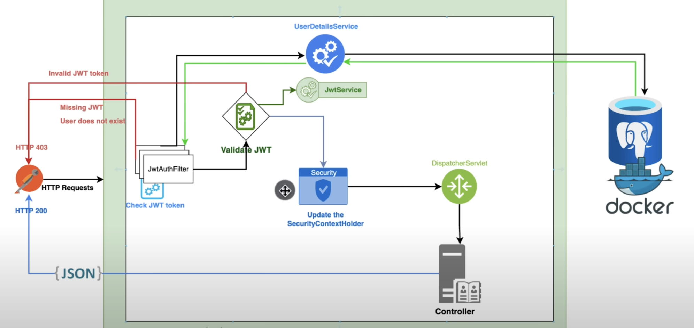

# Spring Security 6

----
Spring Security adalah sebuah framework yang menyediakan autentikasi, autorisasi, dan perlindungan terhadap serangan umum.

## Penjelasan Arsitektur

----
Ketika client melakukan HTTP Request maka akan dilakukan filter oleh `JwtAuthFilter`, dimana akan dilakukan pengecekan
apakah token yang dikirim merupakan token JWT atau bukan. Jika token bukan token JWT maka di keluarkan error 403 - Missing JWT.

Jika token merupakan token JWT selanjutnya token akan di extract untuk mendapatkan informasi yang terdapat
dalam token di `JwtService`. Setelah mendapatkan informasi berupa username dari token JWT maka akan dilakukan pengecekan
apakah user tersebut ada di database atau tidak melalui `UserDetailService`. Jika user tidak ditemukan maka akan
dikeluarkan error 403 - User does not exist.

Setelah itu akan Update SecurityContextHolder dan diteruskan ke DispatcherServlet, 
kemudian diteruskan ke controller dan akan memberikan response berupa JSON.

